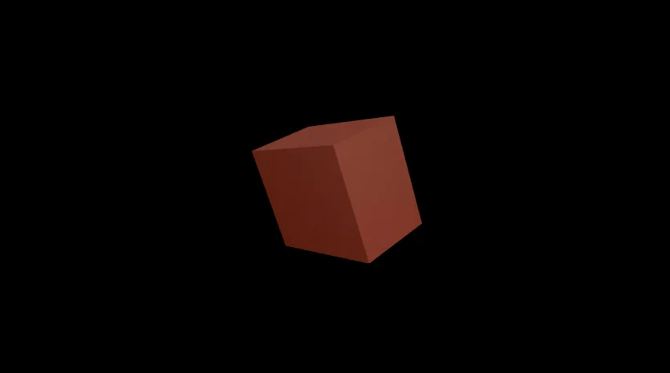
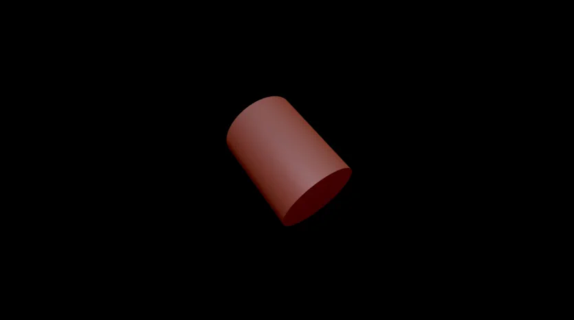
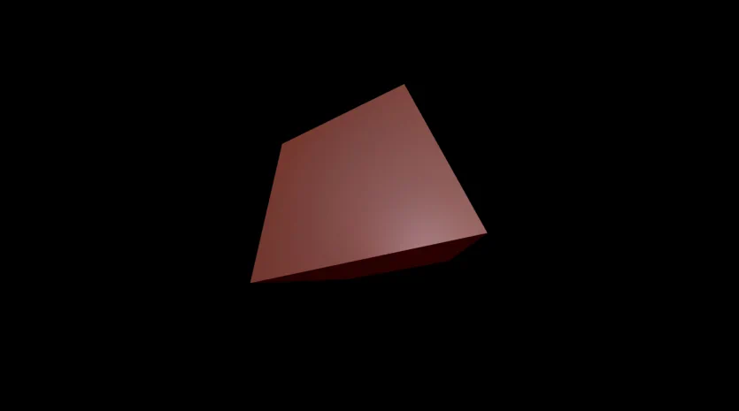

</img> </img>
# Cube Practise
This is a tool for generating cubes, cuboids, cylinders or elliptic cylinders in different angles and FOV.

## Usage
```
https://covector.github.io/cube-practise/?type={OBJECT_NAME}&scale={OVERALL_SCALE}&fov={FOV_APPLIED}
```
All parameters are optional.

## Change Object
Select the object to be displayed.

### Cube
[https://covector.github.io/cube-practise/?type=cube](https://covector.github.io/cube-practise/?type=cube)


### Cuboid
[https://covector.github.io/cube-practise/?type=cuboid](https://covector.github.io/cube-practise/?type=cuboid)



### Cylinder
[https://covector.github.io/cube-practise/?type=cylinder](https://covector.github.io/cube-practise/?type=cylinder)



### Elliptic Cylinder
[https://covector.github.io/cube-practise/?type=elliptic-cylinder](https://covector.github.io/cube-practise/?type=elliptic-cylinder)


## Fixed FOV
Specify the amount of "perspective" applied to the object.

https://covector.github.io/cube-practise/?fov=110

| FOV = 72  | FOV = 110 |
| ------------- | ------------- |
|||

## Overall Scale
Use this when the device width is too small.

https://covector.github.io/cube-practise/?scale=0.5

| Scale = 1  | Scale = 0.5 |
| ------------- | ------------- |
|||